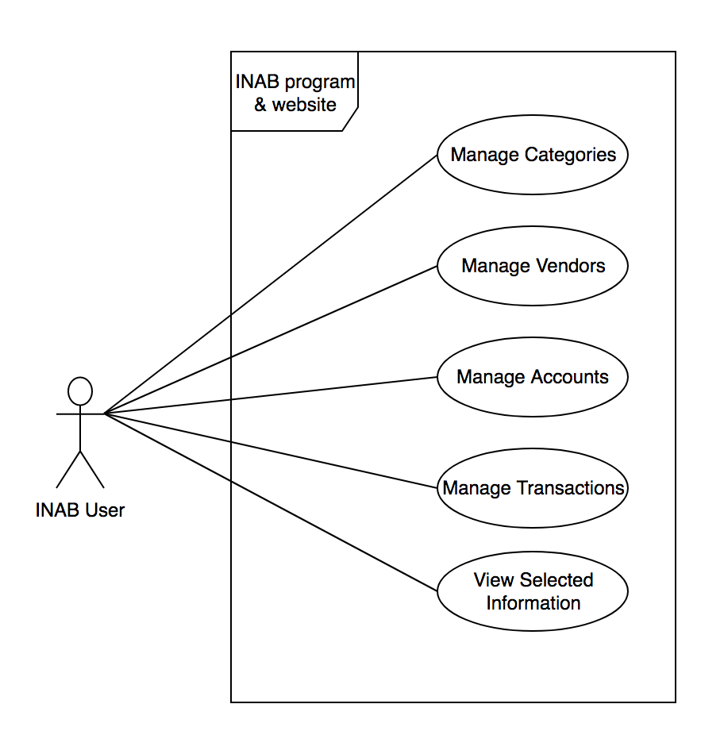
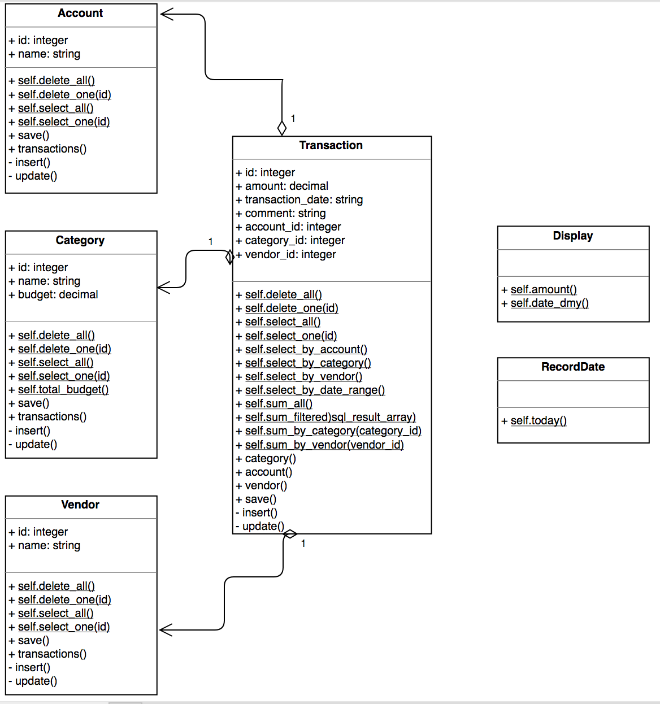
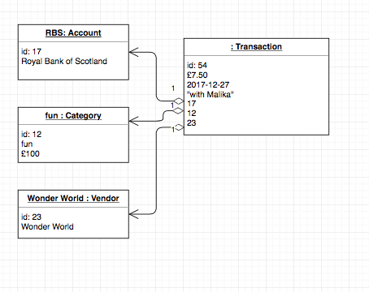
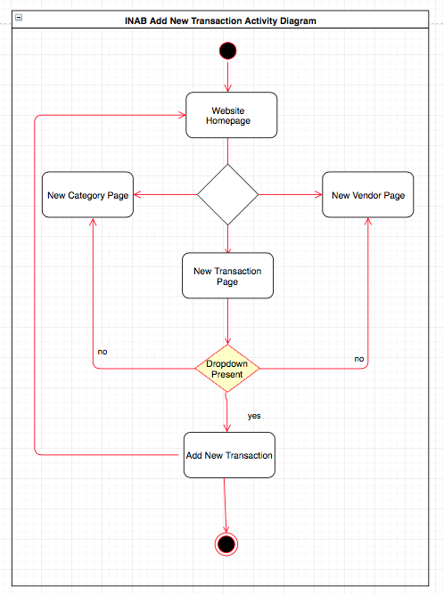
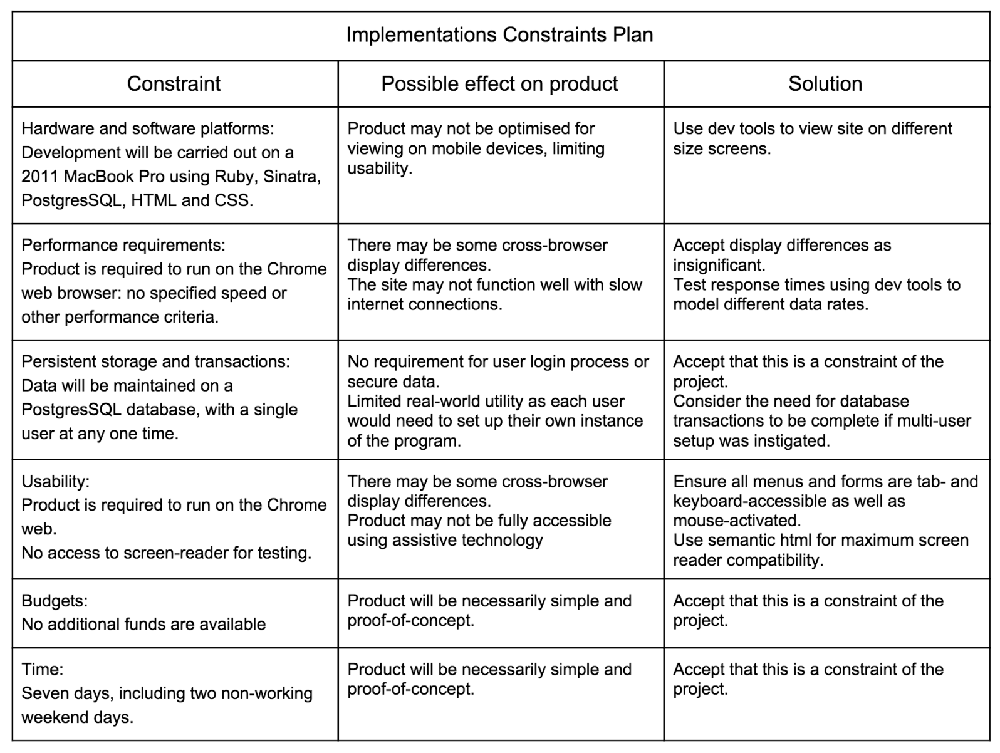

# Analysis and Design Unit Evidence

### A Use Case Diagram

### A Class diagram

### An Object diagram

### An Activity Diagram

### An Inheritance Diagram

### Produce an Implementations Constraints plan detailing the following factors:

- Hardware and software platforms
- Performance requirements
- Persistent storage and transactions
- Usability
- Budgets
- Time

