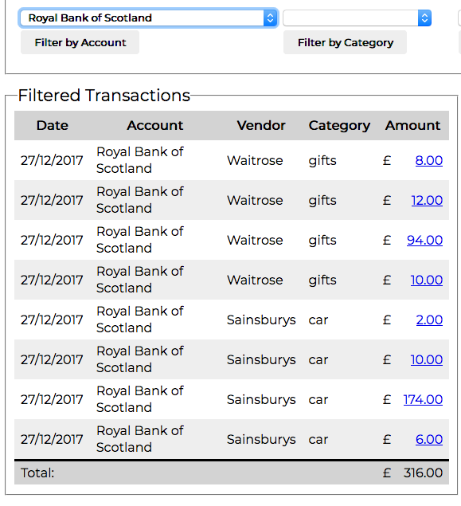
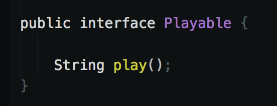
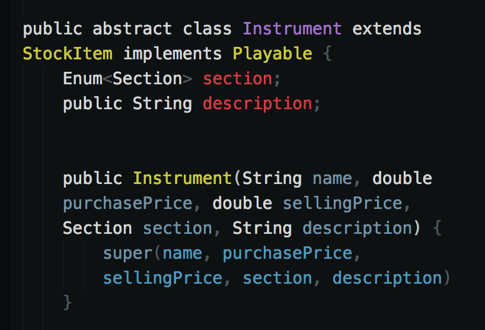
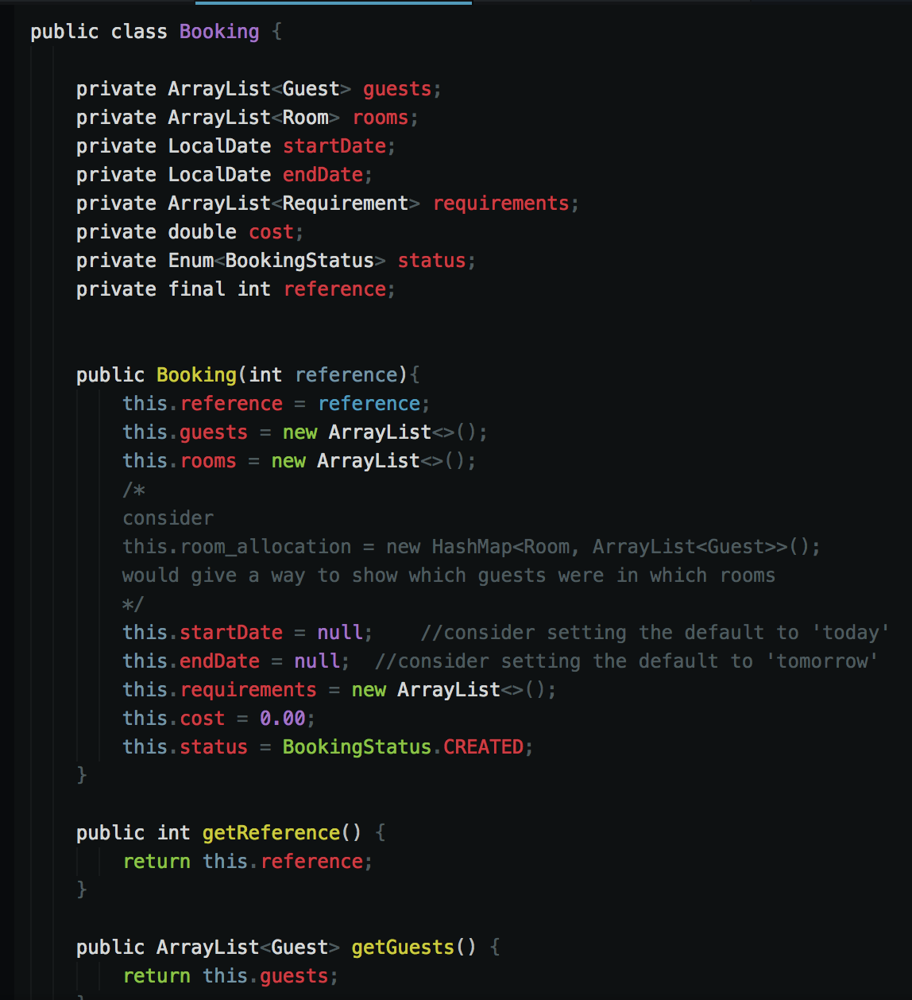
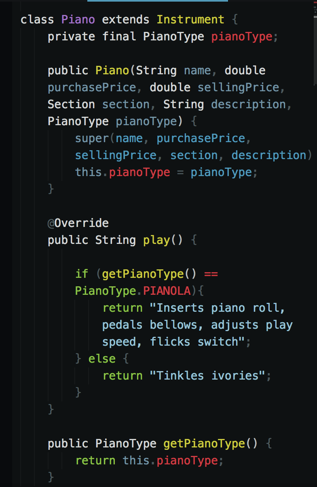
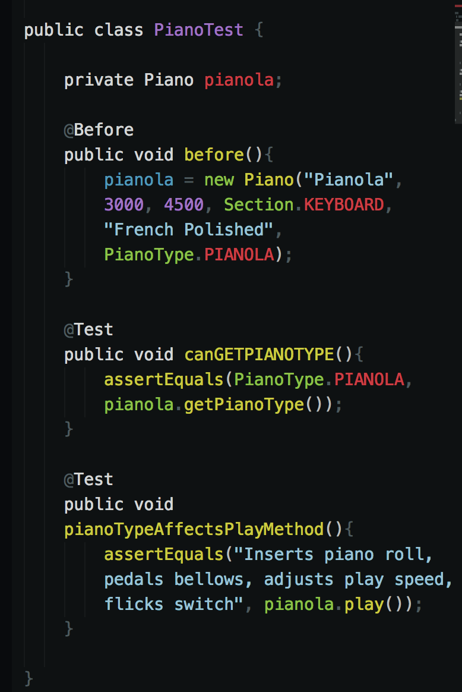
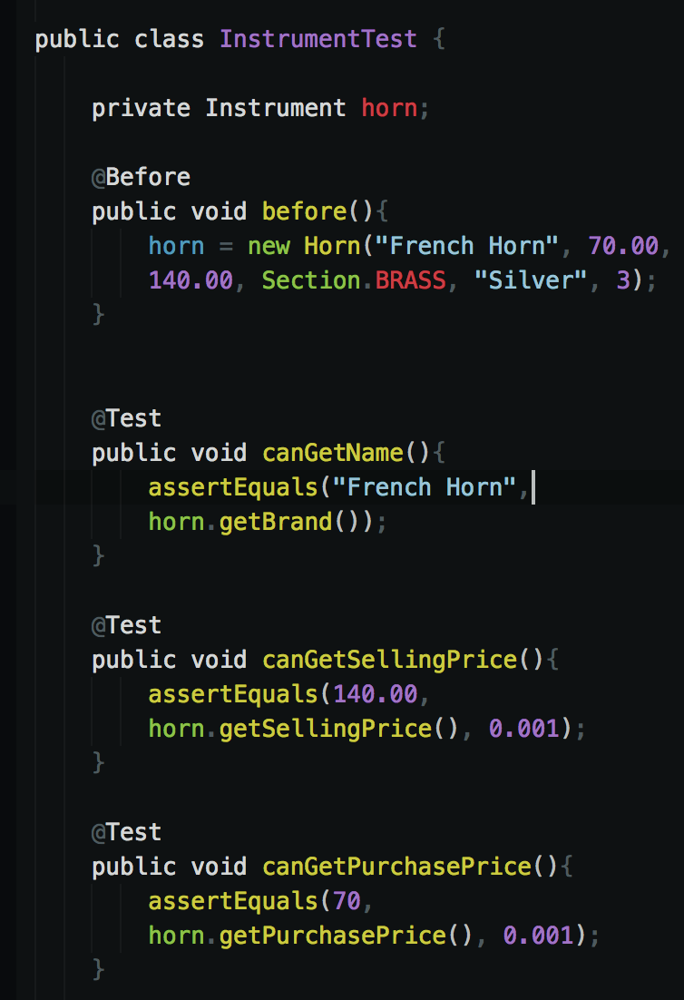

# Implementation and Testing Unit

### Demonstrate the use of an array in a program.
Take screenshots of:
- An array in a program
- A function that uses the array

  

- The result of the function running

  

### Demonstrate the use of a hash in a program.
Take screenshots of:
- A hash in a program
- A function that uses the hash

  

- The result of the function running

  

### Demonstrate searching data in a program.
Take screenshots of:
- Function that searches data

  
- The result of the function running

  

### Demonstrate sorting data in a program.
Take screenshots of:

- Function that sorts data

  
- The result of the function running

  

### Demonstrate the use of Polymorphism in a program.
- the interface which makes polymorphism possible

- implementation

### Take a screenshot of an example of encapsulation in a program.
- 

### Demonstrate the use of Inheritance in a program.
Take screenshots of:

- A Class

- A Class that inherits from the previous class

- An Object in the inherited class [use a test file]
  

- A Method that uses the information inherited from another class [in the test file]
  - inherited methods:
  

### Coding Exercise: Unit and Integration testing task B
- Link to folder containing test files in project
  [Calculator Tests](https://github.com/docljn/ljnoble_pda/tree/master/i_and_t/javascript_calculator/tests)
