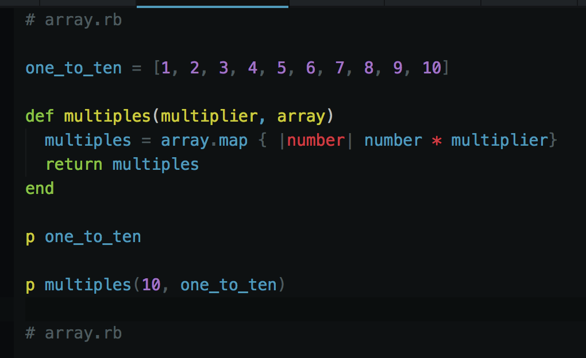
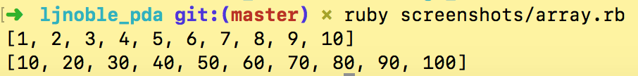
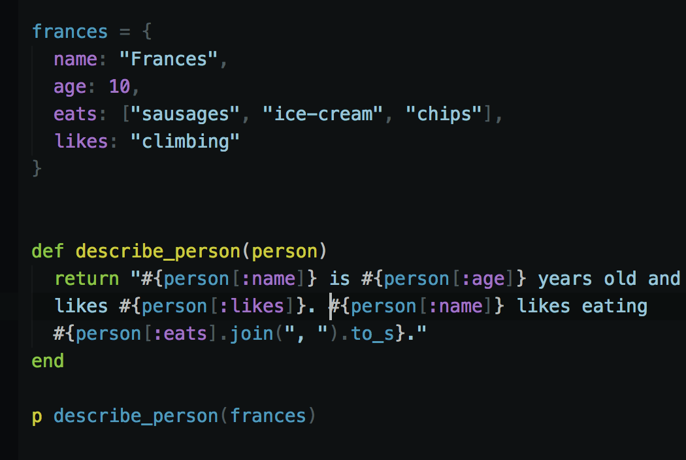
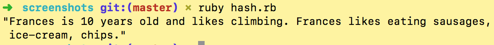
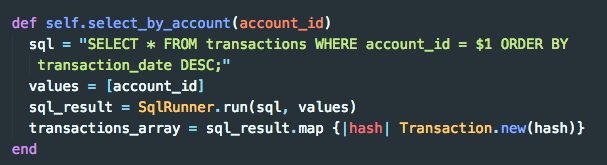
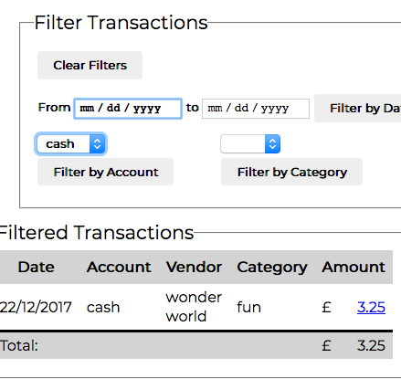

# Implementation and Testing Unit

### Demonstrate the use of an array in a program.
Take screenshots of:
- An array in a program
- A function that uses the array

  

- The result of the function running

  

### Demonstrate the use of a hash in a program.
Take screenshots of:
- A hash in a program
- A function that uses the hash

  

- The result of the function running

  

### Demonstrate searching data in a program.
Take screenshots of:
- Function that searches data

  
- The result of the function running

  

### Demonstrate sorting data in a program.
Take screenshots of:

- Function that sorts data

  
- The result of the function running

  

### Demonstrate the use of Polymorphism in a program.
- TODO

### Take a screenshot of an example of encapsulation in a program.
- TODO

### Demonstrate the use of Inheritance in a program.
Take screenshots of: TODO

- A Class

- A Class that inherits from the previous class

- An Object in the inherited class

- A Method that uses the information inherited from another class

### Coding Exercise: Unit and Integration testing task B
TODO
