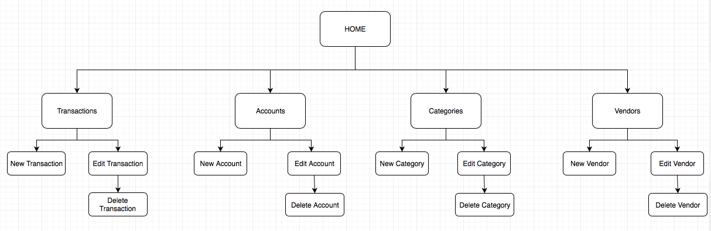

# Project Unit Evidence

### Create a user sitemap
  

### Produce two wireframe designs
  

### Give an example of pseudocode for a function

```
function Sell_Cinema_Ticket_To_Customer

  if the customer can afford the ticket
    and if there are available seats in the cinema

      create a new ticket for the customer
      debit the customer's wallet with the ticket price
      credit the cinema till with the ticket price
      reduce the number of available seats in the cinema

```


### Show user input being processed according to design requirements.
Take a screenshot of:
- The user inputting something into your program

  
- The user input being saved or used in some way

  


### Show an interaction with data persistence.
Take a screenshot of:
- Data being inputted into your program

  
- Confirmation of the data being saved

  


### Show the correct output of results and feedback to user.
Take a screenshot of:
- The user requesting information or an action to be performed
- The user request being processed correctly and demonstrated in the program

  


### Take a screenshot of one of your projects where you have worked alone and attach the Github link.
- [I Need A Budget](https://github.com/docljn/i_need_a_budget_in_ruby_sinatra)
  

### Take screenshots or photos of your planning and the different stages of development to show changes.
- Trello
  


### Demonstrate testing in your program.
Take screenshots of:

- Example of test code
  
- The test code failing to pass
  

- Example of the test code once errors have been corrected
  

- The test code passing
  


### Show an API being used within your program.
Take a screenshot of:

- The code that uses or implements the API
  

- The API being used by the program whilst running
  


### Group Project
Take a screenshot of the contributor’s page on Github from your group project to show the team you worked with.
  

Take a screenshot of the project brief from your group project.
  

Provide a screenshot of the planning you completed during your group project, e.g. Trello MOSCOW board.
  
  
  
  


### Write an acceptance criteria and test plan.


### Produce two system interaction diagrams (sequence and/or collaboration diagrams).
  
  


### Produce two object diagrams.
  
  


### Select two algorithms you have written (NOT the group project).
Take a screenshot of each and write a short statement on why you have chosen to use those algorithms.
  
  -

  
  -

### Produce a bug tracking report
-
