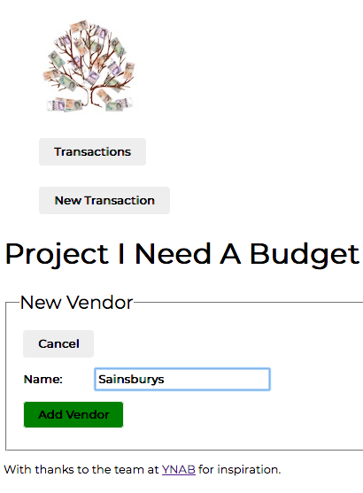
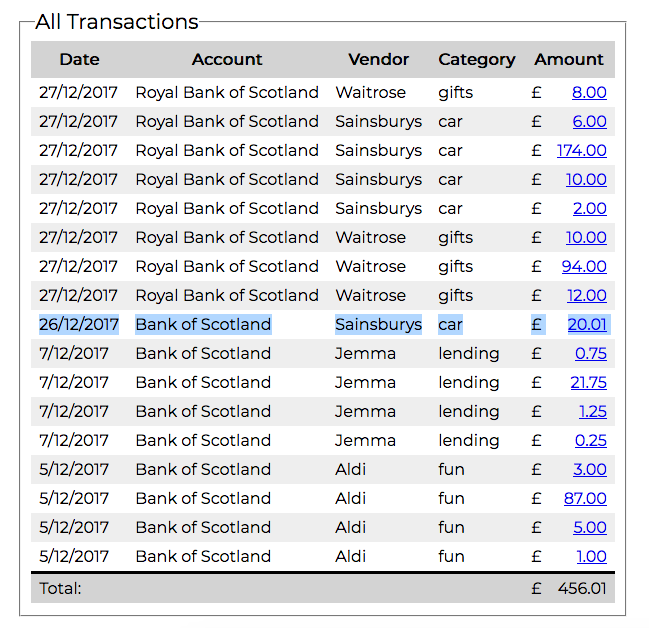
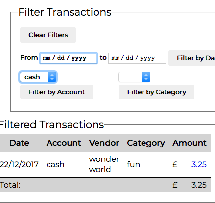
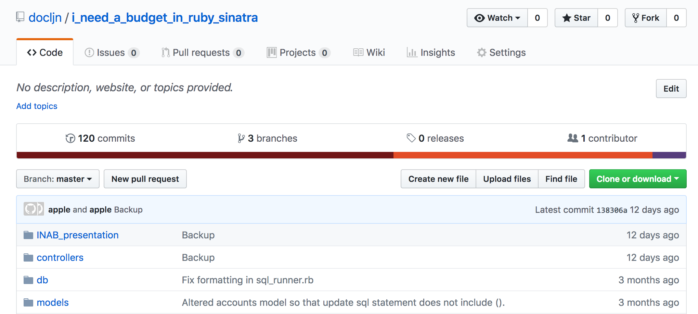
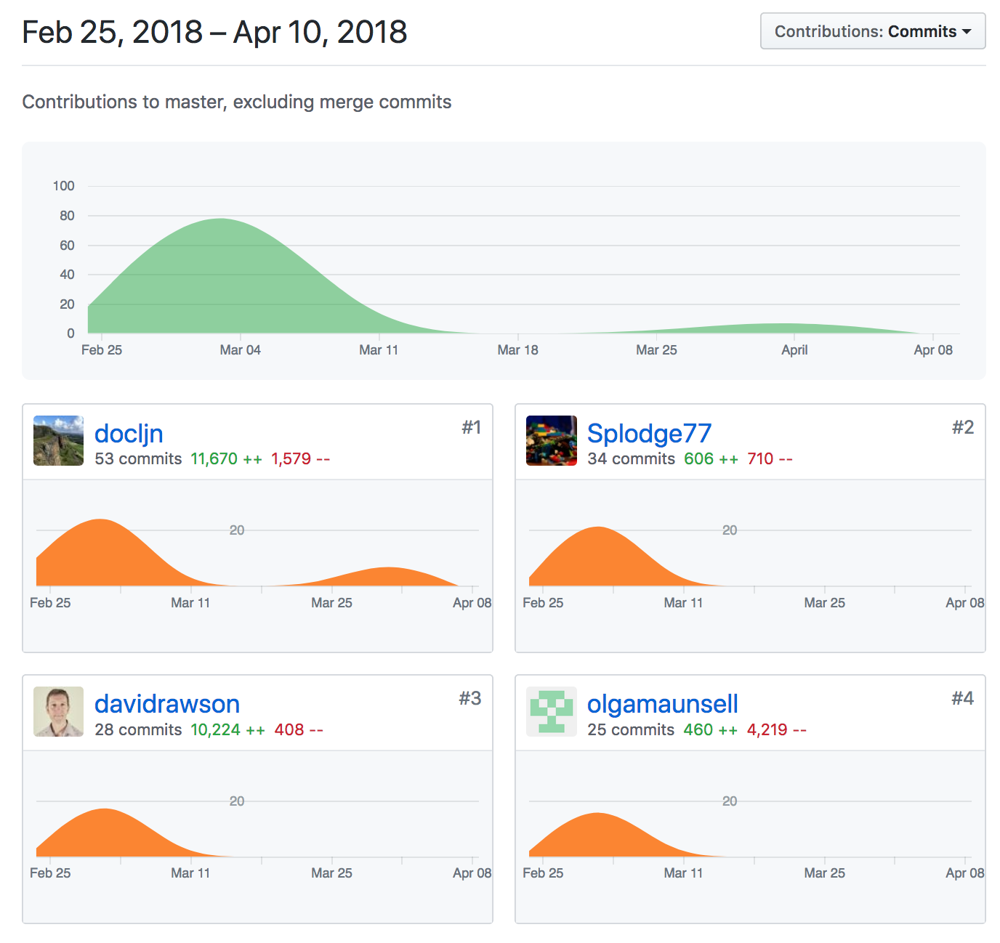

# Project Unit Evidence

### Create a user sitemap
  

### Produce two wireframe designs


### Give an example of pseudocode for a function

```
function Sell_Cinema_Ticket_To_Customer

  if the customer can afford the ticket
    and if there are available seats in the cinema

      create a new ticket for the customer
      debit the customer's wallet with the ticket price
      credit the cinema till with the ticket price
      reduce the number of available seats in the cinema

```


### Show user input being processed according to design requirements.
Take a screenshot of:
- The user inputting something into your program

  
- The user input being saved or used in some way

  


### Show an interaction with data persistence.
Take a screenshot of:
- Data being inputted into your program

  
- Confirmation of the data being saved

  


### Show the correct output of results and feedback to user.
Take a screenshot of:
- The user requesting information or an action to be performed
- The user request being processed correctly and demonstrated in the program

  


### Take a screenshot of one of your projects where you have worked alone and attach the Github link.
- [I Need A Budget](https://github.com/docljn/i_need_a_budget_in_ruby_sinatra)
  

### Take screenshots or photos of your planning and the different stages of development to show changes.
- Trello
  
- ProtoPersona  
  
- User Journey
  
- Initial Commit
  
- Final Commit  
  
- Final Readme
  [Readme.md](https://github.com/docljn/i_need_a_budget_in_ruby_sinatra/blob/master/readme.md)


### Demonstrate testing in your program.

- Test code

  ``` ruby
  require("minitest/autorun")
  require ("minitest/reporters")
  Minitest::Reporters.use! Minitest::Reporters::SpecReporter.new

  require_relative("../models/display.rb")

  class TestCategory < MiniTest::Test

    def test_display_amount_gives_currency_string__10
      assert_equal('10.00', Display.amount(10))
    end

    def test_display_amount_gives_currency_string__1
      assert_equal('1.00', Display.amount(1))
    end

    def test_display_amount_gives_currency_string__10_10
      assert_equal('10.10', Display.amount(10.10))
    end

    def test_display_amount_gives_currency_string__237_05
      assert_equal('237.05', Display.amount(237.05))
    end

    def test_display_amount_returns_negative_numbers__10
      assert_equal('-10.00', Display.amount(-10))
    end

    def test_display_amount_returns_negative_numbers__237_05
      assert_equal('-237.05', Display.amount(-237.05))
    end

  end
  ```

- Code under test

  ```ruby
  class Display

    def self.amount(amount)
      money_array = amount.to_s.split(".")
      pounds = money_array[0]
      pence = money_array[1]
      if pence == nil
        pence = "00"
      end
      return "#{pounds}.#{pence}"
    end
  end
  ```

- Failing test

  

- Corrected code under test

  ```ruby
  class Display

    def self.amount(amount)
      money_array = amount.to_s.split(".")
      pounds = money_array[0]
      pence = money_array[1]
      if pence == nil
        pence = "00"
      end
      if pence.length < 2
        pence = pence + "0"
      end
      if pence.length > 2
        pence = pence.round
      end
      return "#{pounds}.#{pence}"
    end
  end
  ```

- Passing test

  


### Show an API being used within your program.
Take a screenshot of:

- The code that uses or implements the API
  

- The API being used by the program whilst running
  


### Group Project
[Project Readme](https://github.com/docljn/codeclan_group_project/blob/master/README.md)

#### Take a screenshot of the contributor’s page on Github from your group project to show the team you worked with.
  

#### Take a screenshot of the project brief from your group project.
  

#### Provide a screenshot of the planning you completed during your group project, e.g. Trello MOSCOW board.
  
  
  


### Write an acceptance criteria and test plan.
<!-- - TODO -->
- user can click and go to desired page
- etc etc
- cf. PDA lesson 2


### Produce two system interaction diagrams (sequence and/or collaboration diagrams)
- cf. PDA lesson 2
- collaboration diagrams x 2 [two separate activities]
  - initialization
  - class
  - method to next class
  - method to next class
  <!--  TODO
   TODO -->


### Produce two object diagrams
- must be code from your projects
  <!--  TODO
   TODO -->


### Select two algorithms you have written (NOT the group project).
Take a screenshot of each and write a short statement on why you have chosen to use those algorithms.
- algorithm: method that does something with data (sorting, fetching, storing)
  <!-- 
  - TODO

  
  - TODO -->

### Produce a bug tracking report
- this is a thing that happened
- this is why it went wrong
- this is how we fixed it
- cf. PDA lesson 2
<!-- - TODO -->
